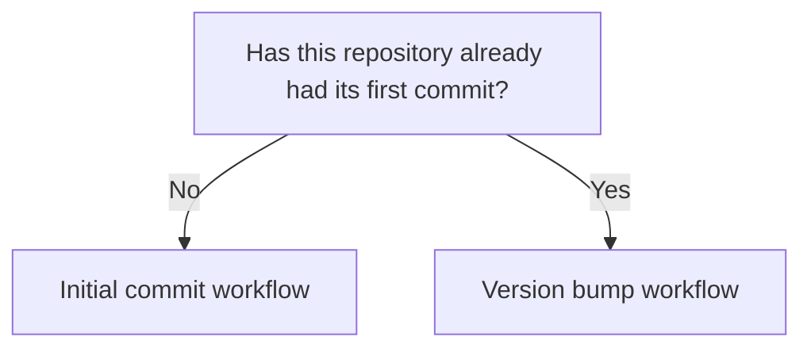

# Commit and Versioning Workflow

Version: 0.1.1
Status: Draft
Style Guide: style-guide--versioned-documents-in-unrendered-markdown

## Abstract

Two paths, one for the first commit and one for every commit after it, because they do not follow the same steps or produce the same kind of commit message.

## Which workflow



GitHub's mermaid renderer strips click links, so on github.com the chart is visual only; the section headings below are the actual navigation.

## Initial commit workflow

Use this once, the first time the repository is committed.

### Verify the branch

```bash
git status
```

If not on `main`:

```bash
git checkout -b main
```

### Stage and review

```bash
git add .
git status
```

The `git status` output after staging is used directly in the commit body. At initial commit this is the full file listing, every file is new. This full listing is expected only here; ordinary bumps produce a much shorter list.

### Commit

Summary line, then the staged file list from `git status`:

```bash
git commit -m "Initial commit, v0.1.0

	new file:   VERSION
	new file:   README.md
	new file:   bump-version.py
	new file:   en/docs/README.md
"
```

Post commit confirmation

```bash
git status
```

Output example:

```bash
On branch main
Your branch is based on 'origin/main', but the upstream is gone.
  (use "git branch --unset-upstream" to fixup)

nothing to commit, working tree clean
```

### Tag and push

Use `-u` on this **first push only**:

```bash
git tag v0.1.0
git push -u origin main
git push origin v0.1.0
```

Every future release goes through the version bump workflow below.

## Version bump workflow

Use this for every release after the initial commit.

### Bump the version

```bash
python3 bump-version.py patch
```

Output example:

```bash
VERSION: 0.1.0 -> 0.1.1
```

Or `minor`, `major`, or an explicit version. This updates the `VERSION` file and nothing else.

Confirm version bump

```bash
git status
```

Output example

```bash
On branch main
Your branch is up to date with 'origin/main'.

Changes not staged for commit:
  (use "git add <file>..." to update what will be committed)
  (use "git restore <file>..." to discard changes in working directory)
	modified:   VERSION
	modified:   docs/en/devops/commit-and-versioning-workflow-v0-1-1.md

no changes added to commit (use "git add" and/or "git commit -a")
```

Note: Since I am updating this file it shows up in addition to our version bump.

### Stage and review

Stage any other files that belong in this release alongside the version bump, then review:

```bash
git add .
git status
```

A pure version-bump commit changes only `VERSION`. If other files changed too, the commit message should reflect that.

### Commit

Summary line references the new version. Body is the staged file list from `git status`:

```bash
git commit -m "Bump version to 0.1.1

	modified:   VERSION
"
```

If additional files are included:

```bash
 git commit -m "Bump version to 0.1.1 
        modified:   VERSION
        modified:   docs/en/devops/commit-and-versioning-workflow-v0-1-1.md
"
```

Output example:

```bash
[main 98a3af4] Bump version to 0.1.1 	modified:   VERSION 	modified:   docs/en/devops/commit-and-versioning-workflow-v0-1-1.md
 2 files changed, 47 insertions(+), 2 deletions(-)
```

### Tag and push

```bash
git tag v0.1.1
git push
git push origin v0.1.1
```

## License

This document, *Commit and Versioning Workflow*, by **Christopher Steel**, with AI assistance from **Claude Sonnet 4.6 (Anthropic)**, is licensed under the [GNU Affero General Public License v3.0 or later](https://www.gnu.org/licenses/agpl-3.0.html).

## Changelog

| Version | Status | Notes |
|---------|--------|-------|
| 0.1.1 | Draft | Compliance pass: replaced the em dash in the initial-commit example message with a comma |
| 0.1.0 | Draft | Initial draft, generalized from the osat-fluent-rclone-tool workflow into a project-neutral guide |
