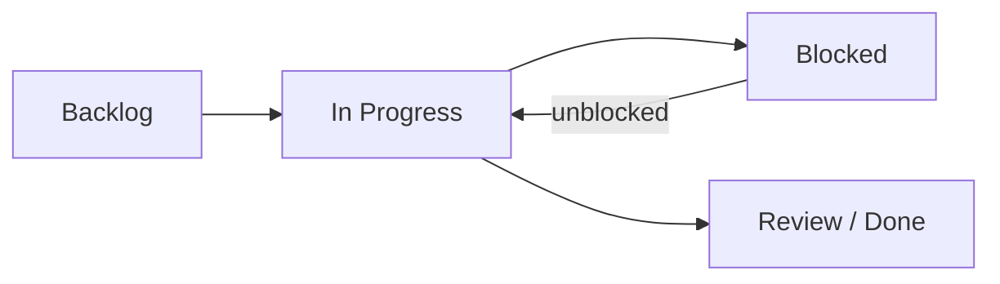

# Universal Cake Kanban Setup

## Purpose

This document defines a minimal Kanban board for managing work across all Universal Cake projects. It is sized for a tiny team, one to three people, and designed to be useful immediately without ceremony, tooling decisions, or process overhead. The entire system fits on a single board because the constraint is not per-project capacity, it is the same person's attention across multiple repositories.

## The Board

Four columns. Not three, not six. Four is enough to distinguish "waiting for me to start" from "blocked on something I cannot control right now," which is a real and recurring state for a solo or tiny team that three columns swallow silently.

**Backlog** — prioritised list of work not yet started. Anything from any Universal Cake project lives here. The item at the top is the next thing to pull.

**In Progress** — actively being worked on right now. Work-in-progress limit: **two items per person**. This is the only rule that matters. If both slots are full, finish or park something before pulling from the backlog.

**Blocked** — waiting on something outside your control, a dependency, a response, a decision from someone else, a tool you cannot yet install. Items here do not count against your WIP limit, they are not competing for your attention, they are waiting. Each blocked item carries a one-line note saying what it is waiting for.

**Review / Done** — completed work. This is where the Virtuous Iteration questions are asked, see below. Items leave this column when the answers are recorded, even if the answers are short.

## Work Items

A work item is one thing a person could finish and move to Review / Done. Not a project, not a theme, not a goal. One deliverable with a clear done state.

Good items:

- Draft the myrepos radar assess entry
- Update the radar entry template to reflect the metrics document v0.3.1
- Write the uc-workspace .mrconfig for the four current repos
- Fix the duplicate mdformat entries in assess and adopt
- Push bump-version.py from sat-doc-automa to uc-radar

Bad items (too large, split them):

- Sort out the radar
- Fix all the documentation
- Evaluate everything in assess

If an item has been In Progress for more than a week without moving, it is too large. Split it.

## Tagging by Project

Every item carries a short project tag so the board remains scannable across repositories without needing a separate board per project.

| Tag | Repository | What lives there |
| --- | ---------- | ---------------- |
| `radar` | uc-radar | Evaluation entries, lifecycle, template, governance |
| `automa` | sat-doc-automa | Style guides, markdown defaults, license templates, scripts |
| `sat` | sat | The Python tool, its own code and tests |
| `fluent` | osat-fluent-* | Fluent tools, one tag for the whole line |
| `uc` | Universal Cake cross-cutting | Mission language, the Virtuous Iteration document, anything that belongs to no single repo |

If the project list grows beyond five tags, reconsider whether the board should split. For now it should not.

## The Review Point

When an item moves to Review / Done, three things happen before it is considered closed. This is where the Virtuous Iteration layer attaches to Kanban without adding any ceremony.

**First**, confirm the item is actually done. Can someone else pick it up and use it, merge it, or read it without coming back to ask questions? If not, it is not done.

**Second**, ask the two questions:

> How does this change include more people?
>
> Whose agency does this serve?

The answer can be one sentence. It can be "this is plumbing, it does not directly affect inclusion or agency." That is an honest answer and it is fine. The point is to ask, not to produce a essay. Tag the answer Verified, Inferred, or Claimed if it makes a substantive claim. Most plumbing items will not need a tag at all.

**Third**, does this item unblock anything in the Blocked column? If so, move the unblocked item back to In Progress, respecting the WIP limit.

## Current Workstreams

As of July 2026, the active work across Universal Cake falls into these areas. This is not a backlog, it is context for understanding what kind of items will appear on the board.

**uc-radar governance** — the lifecycle document, the entry template, the README, and the input-output flow document have been drafted or revised in this session. The radar entry template needs to reference sat-doc-automa's standing rules rather than inlining them, which is blocked on the boilerplate distribution mechanism decision.

**Radar entry triage** — 54 entries in assess, duplicates across assess and adopt (mdformat, Fluid Infusion accessibility bar), version forks sitting side by side (opensource-identity-systems, shims), topic duplication under different names (four Caddy entries, two clean-text entries, two goldmark entries), and structural outliers (the datalad subdirectory, the assessed subdirectory). Each cluster is a separate work item, not one giant cleanup task.

**Boilerplate distribution** — cookiecutter and cruft are radar-evaluated but not adopted. myrepos is now in assess. The decision about how sat-doc-automa content gets into consuming repos is open, and several other items are blocked on it.

**sat-doc-automa maintenance** — the style guides, license templates, and scripts are the source of truth but have no automated push mechanism yet. Manual copy is the current stopgap.

**Virtuous Iteration documentation** — the explainer document exists in draft. Its honest tally (six governance revisions, all tagged Claimed) is the baseline for future audits.

**osat-fluent tool work** — current state not visible in this session, tagged `fluent` when items appear.

## Where to Host the Board

For a tiny team, the medium is less important than the habit. Three options in order of simplicity:

**A markdown file in the uc-workspace root**, if that workspace is set up. A table with four columns, each item on one row, tags in a column. Updated by editing the file directly. Version controlled. No tooling dependency. Degrades to a text file if every other tool disappears.

**A GitHub Projects board**, if the repositories are already on GitHub. Columns map directly, tags become labels, items can link to issues. Adds dependency on GitHub but gains drag-and-drop and filtering.

**Sticky notes on a wall**, if you are working in one physical space. Nothing to install, nothing to configure, tactile, visible without opening anything. Degrades when you are not in that room.

Pick one. If it stops working, switch. The board is disposable, the habit of limiting work in progress and asking the questions at the review point is not.

## What This Document Does Not Cover

- Prioritisation method for the backlog, whatever you are already doing is probably fine
- Estimation, a tiny team does not need story points
- Reporting or velocity tracking, the board is for the people doing the work, not for a status report
- Multi-team coordination, if the team grows past three people, revisit this document

## Copyright and Attribution (CAP)

**Copyright © 2026 Christopher Steel**

This document is licensed under the **Creative Commons Attribution-ShareAlike 4.0 International (CC BY-SA 4.0)**.

You are free to copy, redistribute, adapt, and build upon this work, including for commercial purposes, provided that:

1. Appropriate attribution is given to the original author;
2. A link to the license is provided; and
3. Any derivative works are distributed under the same license.

License: https://creativecommons.org/licenses/by-sa/4.0/
